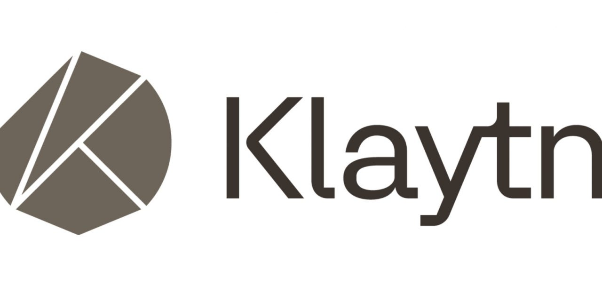



### What is KIP-7? What is Klaytn?

[Klaytn](https://www.klaytn.com/) is an enterprise-grade, service-centric platform developed by Kakao, Korea. Klaytn, the currency running on the platform, is the 39th largest cryptocurrency in crypto market capitalization.

KIP-7 is a fungible Klaytn Compatible Token (KCT) that has properties of uniformity and divisibility, which is very similar to ERC-20 from Ethereum.

Differences with ERC - 20 are:

- More optional functions are included (e.g. mint, burn and pause extension).
- Every token transfer/mint/burn MUST be tracked by event logs. This means that a Transaction MUST be emitted for any action related to transfer/mint/burn.
- The KIP-13 interface for each method group MUST be implemented.

KIP-7 tokens are easily exchangeable in [KLAYswap](https://klayswap.com/), the Klaytn's DeFi solution that can take advantage of this high liquidity environment.

### Whitepaper

If you want to know more about **Sigmoid**, then have a look at our [whitepaper](https://sigmoid-token.github.io/whitepaper/).

[Download PDF]({{ "/assets/sigmoid_whitepaper.pdf" | relative_url }}){: .btn .btn--success .btn--large}

### Donation

You want to support us?

Unfortunately, ICO (initial coin offering) is illegal in our country, so the only way we can get support is to get it from donation platforms.

If you want to buy a drink for a poor guy who lost a penny due to a recent news about quantitative tightening, please feel free to press the button below:

